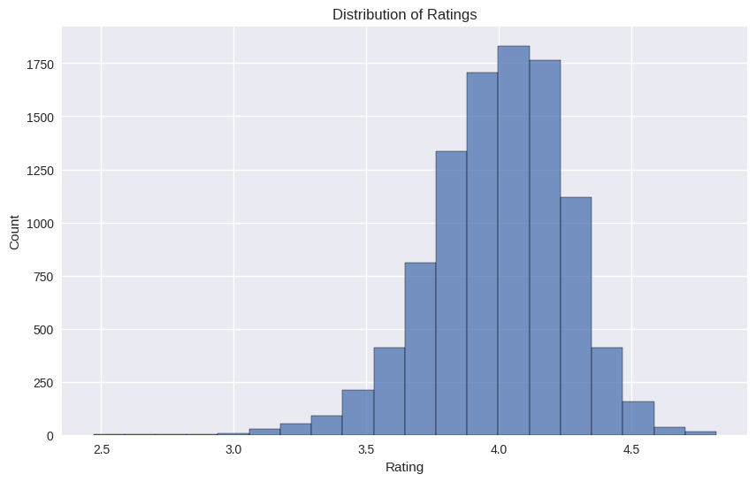
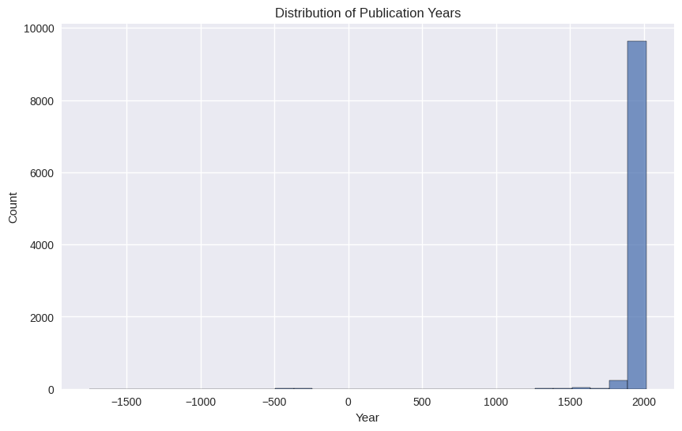
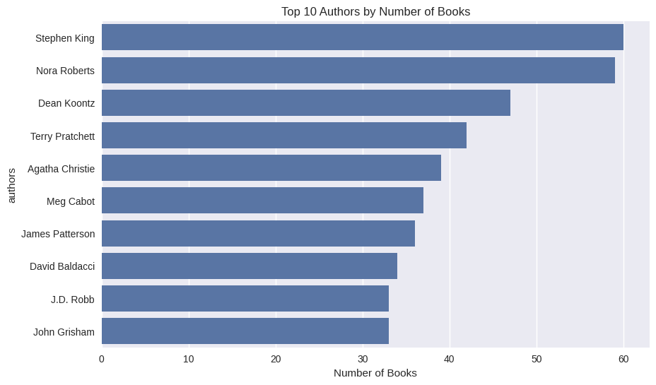

# Dataset Analysis Report

## Overview
- Dataset Type: books
- Number of Records: 10000
- Number of Features: 23

## Key Features
book_id, goodreads_book_id, best_book_id, work_id, books_count, isbn, isbn13, authors, original_publication_year, original_title, title, language_code, average_rating, ratings_count, work_ratings_count, work_text_reviews_count, ratings_1, ratings_2, ratings_3, ratings_4, ratings_5, image_url, small_image_url

## Data Quality
Missing values per column:
- isbn: 700
- isbn13: 585
- original_publication_year: 21
- original_title: 585
- language_code: 1084

## Visualizations

